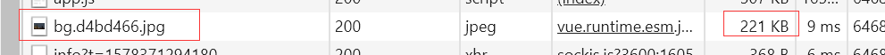
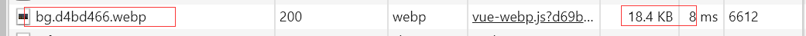

<h1 align="center" style="border-bottom: none;">generate-webp-webpack-plugin</h1>
<h3 align="center">这是一个生成webp图片文件的webpack插件</h3>
<p align="center">
  <a href="https://www.travis-ci.org/Linnanli/generate-webp-webpack-plugin">
    
  </a>
  <a href='https://coveralls.io/github/Linnanli/generate-webp-webpack-plugin?branch=master'>
    
  </a>
  
</p>

# 支持webpack版本

支持webpack3.0+、webpack4.0+

# 指定二进制文件下载的base url

针对国内用户下载缓慢、下载失败的问题或者内网隔离用户，提供了为cwebp-bin二进制文件配置镜像下载地址的功能。

通过在`.npmrc`中配置变量: 

* 手动写入: `cwebp_binary_site=https://npm.taobao.org/mirrors/cwebp-bin`

* 通过`shell`写入: `$ echo "cwebp_binary_site=https://npm.taobao.org/mirrors/cwebp-bin" >> .npmrc`

# 安装

## npm

``` hash
$ npm install generate-webp-webpack-plugin --save-dev
```

## yarn

``` hash
$ yarn add generate-webp-webpack-plugin -D
```

# 用法

在`webpack` `plugins`数组中实例化`generate-webp-webpack-plugin`插件

``` javascript
const GenerateWebpWebpackPlugin = require('generate-webp-webpack-plugin')

{
    plugins: [
        new GenerateWebpWebpackPlugin()
    ]
}
```

# 参数

## test

* **类型**: `{ [path: string]: Function } | RegExp`

* **默认值**: `/\.(png|jpe?g)$/`

* **用法**:

``` javascript
new GenerateWebpWebpackPlugin({
  test: /\.(png|jpe?g)$/
})
```
匹配所有`png`、`jpg`、`jpeg`图片,然后生成同名的`webp`图片

## format

* **类型**: `string`

* **默认值**: `[name].webp`

* **用法**:

``` javascript
new GenerateWebpWebpackPlugin({
  format: '[name].[ext].webp'
})
```
将最后输出的图片名称格式化

结果如下：

`./img/bg.png` => `./img/bg.png.webp`

## webpOptions

`webpOptions`是`imagemin-webp`工具的参数，更多设置可以点击[imagemin-webp](https://github.com/imagemin/imagemin-webp)查看

下面介绍两个常用的参数：

### quality

* **类型**: `{ number }`

* **默认值**: `75`

* **详细**:

`quality`是设置图片质量的参数，区间是`0`~`100`.

* **用法**:

``` javascript
new GenerateWebpWebpackPlugin({
  webpOptions: {
    quality: 75
  }
})
```

### method

* **类型**: `{ number }`

* **默认值**: `4`

* **详细**:

在0（最快）和6（最慢）之间指定要使用的压缩方法。可以在开发环境将速度调快，生产环境使用默认值。

* **用法**:

``` javascript
new GenerateWebpWebpackPlugin({
  webpOptions: {
    method: 0
  }
})
```

### 配合运行时插件使用

`webp`图片已经通过`generate-webp-webpack-plugin`生成了，接下来项目中引入运行时代码，判断浏览器是否支持并处理兼容问题。

#### vue

1.  安装`vue-webp-plugin`

* yarn

``` bash
yarn add vue-webp-plugin
```
* npm 
``` bash
npm install vue-webp-plugin --save
```

2. 在`main.js`入口文件引入`vue-webp-plugin`

``` javascript
import Vue from 'vue'
import VueWebp from 'vue-webp-plugin'

Vue.use(VueWebp)
```

3. 使用`v-webp`指令引入图片

* 设置本地图片路径

``` html

```

* 设置元素背景图片路径

``` html
<div v-webp:bg="require('../../assets/img/bg.jpg')"></div>
```

4. 查看`network`请求日志可以看到`webp`图片的效果

bg.jpg图片在原本是221kb



转换后：



